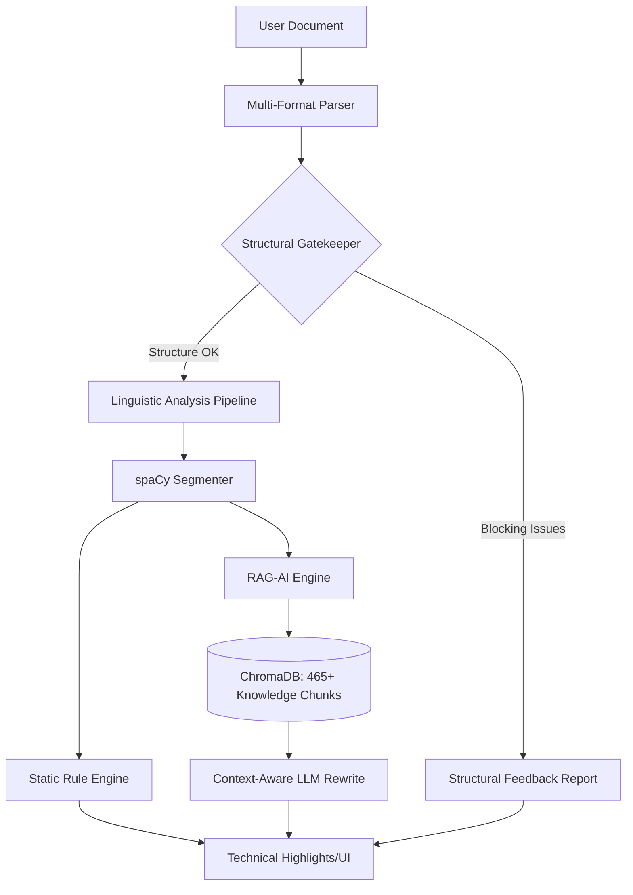

DocScanner AI is an advanced, AI-powered document review system designed for technical writers and content creators. It combines static rule-based analysis with a **RAG (Retrieval-Augmented Generation)** engine to ensure documentation follows enterprise-grade style guides (such as the Siemens Style Guide) while maintaining high readability and semantic clarity.

---

## 🚀 Core Architecture

DocScanner follows a **Reviewer-First Architecture**, prioritizing high-level structural checks before diving into granular sentence-level metrics.

### Technical Stack
- **Backend:** Flask (Python) with Socket.IO for real-time progress tracking.
- **NLP Engine:** spaCy (for segmentation and linguistic tagging).
- **Knowledge Base:** ChromaDB (Vector Database) for style guide storage.
- **AI Engine:** Multi-mode support for **Ollama** (Local AI) and **OpenAI**.
- **Frontend:** Vanilla JS/CSS with Bootstrap, featuring an interactive side-by-side review interface.

---

## 🛠️ Key Features & Workflows

### 📂 Multi-Format Support
The system parses multiple industrial and developer formats into a unified representation while preserving structural integrity:
- **Text & Markdown:** `.txt`, `.md`, `.adoc`
- **Word Documents:** Full `.doc` and `.docx` parsing (via `mammoth`).
- **Formatting Preservation:** Inline bold, italic, and links are preserved to ensure accurate highlighting during the review stage.

### 🛡️ The "Document Review Gate"
To prevent overwhelming users with minor issues in a poorly structured document, DocScanner uses a **Structural Gatekeeper**:
- **Blocking Checks:** Identifies missing goals, lack of numbered steps in procedures, or unclear target audiences.
- **Adaptive Scope:** If a document is "Blocking," the system provides high-level feedback first to guide the writer through a structural fix before sentence-level analysis begins.

---

## 🧠 Intelligent Review Engine

### RAG-Powered AI Suggestions
When an issue is flagged, the AI doesn't just guess a fix. It uses a **context-aware RAG workflow**:
1. **Semantic Search:** The system searches the vector database for the specific rule violated (e.g., Siemens rule for "avoiding filler words").
2. **Context Injection:** The AI is provided with the current sentence plus the surrounding sentences to ensure the suggestion fits the author's voice and flow.
3. **Validation:** Suggestions are compared against the original to ensure improvements in word count, clarity, and structural adherence.

### Style Guide Enforcement
DocScanner applies a hierarchy of rules to every sentence:
- **Siemens Style Guide:** Enforces specific standards (e.g., avoiding "should/could," "it is/there is," and "therefore").
- **Linguistic Precision:** Detects passive voice, overly long sentences (>25 words), and unnecessary adverbs.
- **Tense Consistency:** Encourages active, simple present-tense verbs for procedural instructions.

---

## 📊 Quality Metrics & Dashboard

The dashboard provides immediate quantitative and qualitative feedback:
- **Readability Scores:** Real-time computation of Flesch Reading Ease, Gunning Fog, and SMOG Index.
- **Quality Score:** An overall 0-100 score based on issue density.
- **Progressive Loading:** A real-time socket-based progress bar tracking stages: *Parsing &rarr; Extracting &rarr; Analyzing &rarr; Reporting.*

---

## 🎨 Interactive UI Features

!!! example "Advanced Highlighting"
    **Bidirectional Highlighting:** Hovering over an issue in the sidebar highlights the exact sentence in the document view, and clicking a sentence in the document filters the issue list.

- **AI Suggestion Panel:** A dedicated interface to view, accept, or reject AI-powered rewrites.
- **Performance Monitor:** Tracks the helpfulness of AI suggestions to refine model performance.
- **Premium Dark Mode:** A state-of-the-art dark interface optimized for long technical review sessions.

---

> [!NOTE] 
> **Latest Update:** The system now features **robust sentence-level highlighting** by removing de-duplication, ensuring that repeated headings or duplicate warnings are correctly identified and flagged.